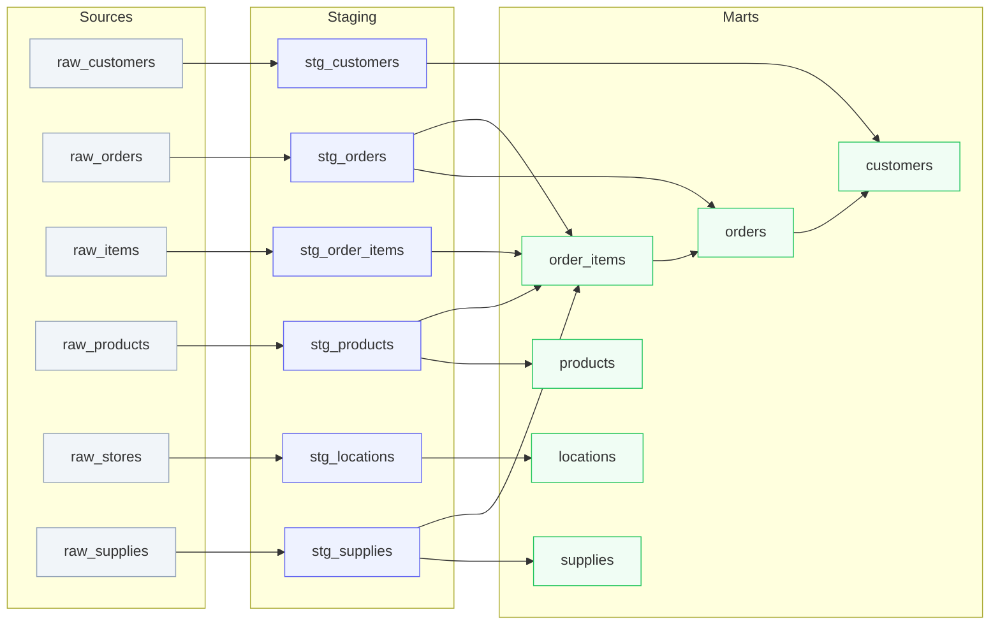

# Data Team Pipeline Health Dashboard Implementation Plan

> **For agentic workers:** REQUIRED: Use superpowers:subagent-driven-development (if subagents available) or superpowers:executing-plans to implement this plan. Steps use checkbox (`- [ ]`) syntax for tracking.

**Goal:** Build an Evidence.dev multi-page dashboard for the data team to monitor dbt pipeline health — model status, test coverage, lineage, data freshness, and column profiling.

**Architecture:** Evidence.dev project with DuckDB connector, reading both live DuckDB data and dbt artifacts (manifest.json, run_results.json, catalog.json). SQL queries are embedded inline in Markdown pages. Each page is a `.md` file with SQL code blocks and Evidence chart components.

**Tech Stack:** Evidence.dev, DuckDB, Node.js 18+, Mermaid (for lineage DAG)

**Spec:** `docs/superpowers/specs/2026-03-20-jaffle-shop-dashboards-design.md`

**Prerequisite:** The dbt project must have been built with `dbt build --target prod` and `dbt docs generate --target prod` so that `target/manifest.json`, `target/run_results.json`, and `target/catalog.json` exist.

---

## File Structure

```
pipeline-dashboard/
├── evidence.plugins.yaml       # DuckDB plugin config
├── package.json                # Evidence.dev project dependencies
├── sources/
│   └── jaffle_shop/
│       └── connection.yaml     # DuckDB connection: ../../data/jaffle_shop.duckdb
├── pages/
│   ├── index.md                # Dashboard home — health banner, KPI cards, row counts
│   ├── run-history.md          # Latest build results from run_results.json
│   ├── staging-layer.md        # Staging model details: rows, columns, sources
│   ├── mart-layer.md           # Mart model details: rows, columns, metrics
│   ├── model-lineage.md        # Mermaid DAG of model dependencies
│   ├── test-coverage.md        # Test matrix: model × test type
│   ├── data-freshness.md       # Max dates per source, staleness check
│   └── column-stats.md         # Per-model column profiling via SUMMARIZE
```

- Each `.md` page contains SQL in fenced code blocks (```sql ... ```) that Evidence executes against DuckDB.
- dbt artifacts are loaded via DuckDB's `read_json_auto()` function — no separate data loading needed.
- **Important:** `read_json_auto('../../target/...')` paths are relative to the DuckDB file location or Evidence.dev's working directory. If paths don't resolve, switch to absolute paths using the project root. Verify during Step 7 of Task 1.

---

## Chunk 1: Project Scaffolding and DuckDB Connection

### Task 1: Initialize Evidence.dev project

**Files:**
- Create: `pipeline-dashboard/package.json`
- Create: `pipeline-dashboard/evidence.plugins.yaml`
- Create: `pipeline-dashboard/sources/jaffle_shop/connection.yaml`

- [ ] **Step 1: Create the Evidence.dev project directory**

```bash
mkdir -p pipeline-dashboard/sources/jaffle_shop pipeline-dashboard/pages
```

- [ ] **Step 2: Create package.json**

```json
{
  "name": "jaffle-shop-pipeline-dashboard",
  "version": "1.0.0",
  "private": true,
  "scripts": {
    "dev": "evidence dev",
    "build": "evidence build"
  },
  "dependencies": {
    "@evidence-dev/evidence": "latest",
    "@evidence-dev/core-components": "latest",
    "@evidence-dev/duckdb": "latest"
  }
}
```

- [ ] **Step 3: Create evidence.plugins.yaml**

Note: Evidence.dev plugin config format may vary by version. Verify against `@evidence-dev/duckdb` docs. Start with:

```yaml
datasources:
  jaffle_shop:
    type: duckdb
```

If this format doesn't work, check the Evidence.dev docs for the correct plugin config structure and adjust accordingly.

- [ ] **Step 4: Create DuckDB connection config**

Create `pipeline-dashboard/sources/jaffle_shop/connection.yaml`:

Note: The key name may be `filepath` instead of `filename` depending on the `@evidence-dev/duckdb` version. Verify against the package docs.

```yaml
type: duckdb
options:
  filename: ../../data/jaffle_shop.duckdb
  read_only: true
```

- [ ] **Step 5: Install dependencies**

Run: `cd pipeline-dashboard && npm install`
Expected: `node_modules/` created with Evidence.dev and DuckDB plugin

- [ ] **Step 6: Create a minimal index.md to test connection**

Create `pipeline-dashboard/pages/index.md`:

```markdown
---
title: Pipeline Health Dashboard
---

# Pipeline Health Dashboard

Testing DuckDB connection...

```sql models
SELECT count(*) as model_count FROM information_schema.tables
WHERE table_schema = 'prod'
```

Found <Value data={models} column="model_count" /> tables in the prod schema.
```

- [ ] **Step 7: Verify the dev server starts and connects to DuckDB**

Run: `cd pipeline-dashboard && npm run dev`
Expected: Server starts on localhost:3000, page shows the count of tables in prod schema.

- [ ] **Step 8: Commit**

```bash
git add pipeline-dashboard/package.json pipeline-dashboard/evidence.plugins.yaml pipeline-dashboard/sources/ pipeline-dashboard/pages/index.md
git commit -m "feat(pipeline): scaffold Evidence.dev project with DuckDB connection"
```

---

## Chunk 2: Dashboard Home Page

### Task 2: Build the dashboard home page with KPI cards and row count chart

**Files:**
- Modify: `pipeline-dashboard/pages/index.md`

- [ ] **Step 1: Replace index.md with full home page**

The home page queries dbt artifacts via `read_json_auto()` and DuckDB tables for row counts.

```markdown
---
title: Pipeline Health Dashboard
---

# Pipeline Health Dashboard

Real-time pipeline monitoring from dbt artifacts and DuckDB.

```sql run_results
SELECT
    elapsed_time,
    generated_at,
    args->>'target' as target,
    args->>'which' as command
FROM read_json_auto('../../target/run_results.json')
```

```sql model_summary
SELECT
    t.table_schema,
    t.table_name,
    t.table_type
FROM information_schema.tables t
WHERE t.table_schema IN ('prod', 'raw')
ORDER BY t.table_schema, t.table_name
```

```sql test_results
SELECT
    r.status,
    count(*) as cnt
FROM read_json_auto('../../target/run_results.json') rr,
     unnest(rr.results) as r
WHERE r.unique_id LIKE 'test.%'
GROUP BY 1
```

```sql row_counts
SELECT 'customers' as model, count(*) as rows FROM prod.customers
UNION ALL SELECT 'orders', count(*) FROM prod.orders
UNION ALL SELECT 'order_items', count(*) FROM prod.order_items
UNION ALL SELECT 'products', count(*) FROM prod.products
UNION ALL SELECT 'locations', count(*) FROM prod.locations
UNION ALL SELECT 'supplies', count(*) FROM prod.supplies
ORDER BY rows DESC
```

## Pipeline Status

<Alert status="info">
  Last build: <Value data={run_results} column="generated_at" /> — Target: <Value data={run_results} column="target" /> — Duration: <Value data={run_results} column="elapsed_time" fmt="0.00" />s
</Alert>

```sql manifest_stats
SELECT
    count(*) FILTER (WHERE n.value->>'resource_type' = 'model') as model_count,
    count(*) FILTER (WHERE n.value->>'resource_type' = 'seed') as seed_count,
    count(*) FILTER (WHERE n.value->>'resource_type' = 'source') as source_count,
    count(*) FILTER (WHERE n.value->>'resource_type' = 'metric') as metric_count
FROM read_json_auto('../../target/manifest.json') m,
     unnest(map_entries(m.nodes)) as n
WHERE n.value->>'package_name' = 'jaffle_shop'
```

<BigValue
  data={manifest_stats}
  value="model_count"
  title="Models"
/>

<BigValue
  data={test_results.filter(d => d.status === 'pass')}
  value="cnt"
  title="Tests Passing"
/>

<BigValue
  data={manifest_stats}
  value="seed_count"
  title="Seeds"
/>

<BigValue
  data={manifest_stats}
  value="source_count"
  title="Sources"
/>

<BigValue
  data={manifest_stats}
  value="metric_count"
  title="Metrics"
/>

## Row Counts by Model

<BarChart
  data={row_counts}
  x="model"
  y="rows"
  colorPalette={['#6366f1']}
/>
```

- [ ] **Step 2: Verify the home page renders**

Run: `cd pipeline-dashboard && npm run dev`
Expected: Dashboard shows pipeline status banner, KPI big values, and row count bar chart.

- [ ] **Step 3: Commit**

```bash
git add pipeline-dashboard/pages/index.md
git commit -m "feat(pipeline): add dashboard home with KPIs and row count chart"
```

---

## Chunk 3: Run History and Test Coverage Pages

### Task 3: Build the run history page

**Files:**
- Create: `pipeline-dashboard/pages/run-history.md`

- [ ] **Step 1: Create run-history.md**

```markdown
---
title: Run History
---

# Run History

Latest build results from `run_results.json`.

```sql run_meta
SELECT
    generated_at,
    elapsed_time,
    args->>'target' as target,
    args->>'which' as command
FROM read_json_auto('../../target/run_results.json')
```

```sql results
SELECT
    r.unique_id,
    r.status,
    r.execution_time,
    r.adapter_response->>'rows_affected' as rows_affected,
    CASE
        WHEN r.unique_id LIKE 'model.%' THEN 'model'
        WHEN r.unique_id LIKE 'test.%' THEN 'test'
        WHEN r.unique_id LIKE 'seed.%' THEN 'seed'
        WHEN r.unique_id LIKE 'unit_test.%' THEN 'unit_test'
        ELSE 'other'
    END as node_type,
    split_part(r.unique_id, '.', 3) as name
FROM read_json_auto('../../target/run_results.json') rr,
     unnest(rr.results) as r
ORDER BY r.execution_time DESC
```

```sql status_summary
SELECT
    status,
    count(*) as count
FROM ${results}
GROUP BY 1
```

**Build:** <Value data={run_meta} column="command" /> on <Value data={run_meta} column="generated_at" />
**Target:** <Value data={run_meta} column="target" />
**Duration:** <Value data={run_meta} column="elapsed_time" fmt="0.00" />s

## Results by Status

<BarChart
  data={status_summary}
  x="status"
  y="count"
  colorPalette={['#22c55e', '#f59e0b', '#ef4444']}
/>

## All Results

<DataTable data={results} rows=50>
  <Column id="name" title="Name" />
  <Column id="node_type" title="Type" />
  <Column id="status" title="Status" />
  <Column id="execution_time" title="Duration (s)" fmt="0.000" />
</DataTable>
```

- [ ] **Step 2: Verify page renders**

Run: `cd pipeline-dashboard && npm run dev`
Navigate to `/run-history`. Expected: Shows build metadata, status bar chart, and results table.

- [ ] **Step 3: Commit**

```bash
git add pipeline-dashboard/pages/run-history.md
git commit -m "feat(pipeline): add run history page"
```

---

### Task 4: Build the test coverage page

**Files:**
- Create: `pipeline-dashboard/pages/test-coverage.md`

- [ ] **Step 1: Create test-coverage.md**

```markdown
---
title: Test Coverage
---

# Test Coverage

Test results matrix from the latest `dbt build`.

```sql tests
SELECT
    r.unique_id,
    r.status,
    r.execution_time,
    split_part(r.unique_id, '.', 3) as test_name,
    CASE
        WHEN r.unique_id LIKE '%not_null%' THEN 'not_null'
        WHEN r.unique_id LIKE '%unique%' THEN 'unique'
        WHEN r.unique_id LIKE '%relationships%' THEN 'relationships'
        WHEN r.unique_id LIKE '%expression_is_true%' THEN 'expression_is_true'
        WHEN r.unique_id LIKE '%accepted_values%' THEN 'accepted_values'
        WHEN r.unique_id LIKE 'unit_test.%' THEN 'unit_test'
        ELSE 'other'
    END as test_type
FROM read_json_auto('../../target/run_results.json') rr,
     unnest(rr.results) as r
WHERE r.unique_id LIKE 'test.%' OR r.unique_id LIKE 'unit_test.%'
ORDER BY test_type, test_name
```

```sql by_type
SELECT
    test_type,
    count(*) as total,
    count(*) FILTER (WHERE status = 'pass') as passing,
    count(*) FILTER (WHERE status = 'fail') as failing
FROM ${tests}
GROUP BY 1
ORDER BY 1
```

## Coverage by Test Type

<BarChart
  data={by_type}
  x="test_type"
  y={["passing", "failing"]}
  type="stacked"
  colorPalette={['#22c55e', '#ef4444']}
/>

## All Tests

<DataTable data={tests} rows=50>
  <Column id="test_name" title="Test" />
  <Column id="test_type" title="Type" />
  <Column id="status" title="Status" />
  <Column id="execution_time" title="Duration (s)" fmt="0.000" />
</DataTable>
```

- [ ] **Step 2: Verify page renders**

Navigate to `/test-coverage`. Expected: Stacked bar chart by test type, full test results table.

- [ ] **Step 3: Commit**

```bash
git add pipeline-dashboard/pages/test-coverage.md
git commit -m "feat(pipeline): add test coverage page"
```

---

## Chunk 4: Model Layer Pages

### Task 5: Build the staging layer page

**Files:**
- Create: `pipeline-dashboard/pages/staging-layer.md`

- [ ] **Step 1: Create staging-layer.md**

```markdown
---
title: Staging Layer
---

# Staging Layer

All staging models — views that clean and standardize raw source data.

```sql staging_models
SELECT
    t.table_name,
    (SELECT count(*) FROM information_schema.columns c
     WHERE c.table_schema = t.table_schema AND c.table_name = t.table_name) as column_count
FROM information_schema.tables t
WHERE t.table_schema = 'prod'
  AND t.table_name LIKE 'stg_%'
ORDER BY t.table_name
```

```sql staging_row_counts
SELECT 'stg_customers' as model, count(*) as rows FROM prod.stg_customers
UNION ALL SELECT 'stg_orders', count(*) FROM prod.stg_orders
UNION ALL SELECT 'stg_order_items', count(*) FROM prod.stg_order_items
UNION ALL SELECT 'stg_products', count(*) FROM prod.stg_products
UNION ALL SELECT 'stg_locations', count(*) FROM prod.stg_locations
UNION ALL SELECT 'stg_supplies', count(*) FROM prod.stg_supplies
ORDER BY rows DESC
```

## Row Counts

<BarChart
  data={staging_row_counts}
  x="model"
  y="rows"
  colorPalette={['#6366f1']}
/>

## Model Details

<DataTable data={staging_row_counts} rows=20>
  <Column id="model" title="Model" />
  <Column id="rows" title="Row Count" fmt="#,##0" />
</DataTable>
```

- [ ] **Step 2: Verify page renders**

Navigate to `/staging-layer`. Expected: Bar chart and table with staging model row counts.

- [ ] **Step 3: Commit**

```bash
git add pipeline-dashboard/pages/staging-layer.md
git commit -m "feat(pipeline): add staging layer page"
```

---

### Task 6: Build the mart layer page

**Files:**
- Create: `pipeline-dashboard/pages/mart-layer.md`

- [ ] **Step 1: Create mart-layer.md**

```markdown
---
title: Mart Layer
---

# Mart Layer

Denormalized analytics tables built from staging models.

```sql mart_models
SELECT
    t.table_name,
    (SELECT count(*) FROM information_schema.columns c
     WHERE c.table_schema = t.table_schema AND c.table_name = t.table_name) as column_count
FROM information_schema.tables t
WHERE t.table_schema = 'prod'
  AND t.table_name NOT LIKE 'stg_%'
ORDER BY t.table_name
```

```sql mart_row_counts
SELECT 'customers' as model, count(*) as rows FROM prod.customers
UNION ALL SELECT 'orders', count(*) FROM prod.orders
UNION ALL SELECT 'order_items', count(*) FROM prod.order_items
UNION ALL SELECT 'products', count(*) FROM prod.products
UNION ALL SELECT 'locations', count(*) FROM prod.locations
UNION ALL SELECT 'supplies', count(*) FROM prod.supplies
UNION ALL SELECT 'metricflow_time_spine', count(*) FROM prod.metricflow_time_spine
ORDER BY rows DESC
```

## Row Counts

<BarChart
  data={mart_row_counts}
  x="model"
  y="rows"
  colorPalette={['#22c55e']}
/>

## Model Details

<DataTable data={mart_row_counts} rows=20>
  <Column id="model" title="Model" />
  <Column id="rows" title="Row Count" fmt="#,##0" />
</DataTable>
```

- [ ] **Step 2: Verify page renders**

Navigate to `/mart-layer`. Expected: Bar chart and table with mart model row counts.

- [ ] **Step 3: Commit**

```bash
git add pipeline-dashboard/pages/mart-layer.md
git commit -m "feat(pipeline): add mart layer page"
```

---

## Chunk 5: Lineage, Freshness, and Column Stats Pages

### Task 7: Build the model lineage page

**Files:**
- Create: `pipeline-dashboard/pages/model-lineage.md`

- [ ] **Step 1: Create model-lineage.md with Mermaid DAG**

The lineage is rendered as a Mermaid flowchart. This is static for v1 — it represents the known DAG from the Jaffle Shop project.

```markdown
---
title: Model Lineage
---

# Model Lineage

Data flow from raw sources through staging to mart models.



**Legend:**
- 🔘 Gray = Raw sources (seeds)
- 🟣 Purple = Staging views
- 🟢 Green = Mart tables

> **Note:** This is the v1 static Mermaid DAG. Interactive features from the spec (layer filter tabs, click-to-detail panels, parameterized drill-down pages) are deferred to a future iteration using a custom Svelte component with dagre-d3. The `metricflow_time_spine` utility model is excluded from the DAG for clarity.

```sql row_counts
SELECT 'customers' as model, count(*) as rows FROM prod.customers
UNION ALL SELECT 'orders', count(*) FROM prod.orders
UNION ALL SELECT 'order_items', count(*) FROM prod.order_items
UNION ALL SELECT 'products', count(*) FROM prod.products
UNION ALL SELECT 'locations', count(*) FROM prod.locations
UNION ALL SELECT 'supplies', count(*) FROM prod.supplies
ORDER BY rows DESC
```

## Current Row Counts

<DataTable data={row_counts}>
  <Column id="model" title="Model" />
  <Column id="rows" title="Rows" fmt="#,##0" />
</DataTable>
```

- [ ] **Step 2: Verify Mermaid diagram renders**

Navigate to `/model-lineage`. Expected: Colored flowchart showing full DAG with row counts table below.

Note: If Evidence.dev doesn't render Mermaid natively, the diagram will appear as code. In that case, replace with a static HTML diagram or use an Evidence `<Graph>` component if available. Check the Evidence.dev docs.

- [ ] **Step 3: Commit**

```bash
git add pipeline-dashboard/pages/model-lineage.md
git commit -m "feat(pipeline): add model lineage page with Mermaid DAG"
```

---

### Task 8: Build the data freshness page

**Files:**
- Create: `pipeline-dashboard/pages/data-freshness.md`

- [ ] **Step 1: Create data-freshness.md**

```markdown
---
title: Data Freshness
---

# Data Freshness

Latest record dates per source table. Stale data = max date older than 2025-12-01.

```sql freshness
SELECT
    'raw_orders' as source_table,
    'ordered_at' as date_column,
    MAX(ordered_at)::DATE as latest_date,
    CURRENT_DATE - MAX(ordered_at)::DATE as days_since_latest,
    CASE WHEN MAX(ordered_at)::DATE < '2025-12-01' THEN '⚠️ Stale' ELSE '✅ Fresh' END as status
FROM raw.raw_orders
UNION ALL
SELECT 'raw_customers', 'N/A (static seed)', NULL, NULL, '✅ Static seed'
UNION ALL
SELECT
    'raw_stores',
    'opened_at',
    MAX(opened_at)::DATE,
    CURRENT_DATE - MAX(opened_at)::DATE,
    CASE WHEN MAX(opened_at)::DATE < '2025-12-01' THEN '⚠️ Stale' ELSE '✅ Fresh' END
FROM raw.raw_stores
UNION ALL
SELECT 'raw_items', 'N/A (linked to orders)', NULL, NULL, '✅ Linked to orders'
ORDER BY source_table
```

## Source Freshness

<DataTable data={freshness}>
  <Column id="source_table" title="Source Table" />
  <Column id="date_column" title="Date Column" />
  <Column id="latest_date" title="Latest Date" />
  <Column id="days_since_latest" title="Days Since Latest" />
  <Column id="status" title="Status" />
</DataTable>
```

- [ ] **Step 2: Verify page renders**

Navigate to `/data-freshness`. Expected: Table showing source freshness with status indicators.

- [ ] **Step 3: Commit**

```bash
git add pipeline-dashboard/pages/data-freshness.md
git commit -m "feat(pipeline): add data freshness page"
```

---

### Task 9: Build the column stats page

**Files:**
- Create: `pipeline-dashboard/pages/column-stats.md`

- [ ] **Step 1: Create column-stats.md**

```markdown
---
title: Column Stats
---

# Column Stats

Column-level profiling for mart models using DuckDB `SUMMARIZE`.

```sql orders_profile
SUMMARIZE prod.orders
```

```sql customers_profile
SUMMARIZE prod.customers
```

```sql order_items_profile
SUMMARIZE prod.order_items
```

## Orders

<DataTable data={orders_profile} rows=20>
  <Column id="column_name" title="Column" />
  <Column id="column_type" title="Type" />
  <Column id="count" title="Count" fmt="#,##0" />
  <Column id="null_percentage" title="Null %" />
  <Column id="approx_unique" title="Distinct" fmt="#,##0" />
  <Column id="min" title="Min" />
  <Column id="max" title="Max" />
</DataTable>

## Customers

<DataTable data={customers_profile} rows=20>
  <Column id="column_name" title="Column" />
  <Column id="column_type" title="Type" />
  <Column id="count" title="Count" fmt="#,##0" />
  <Column id="null_percentage" title="Null %" />
  <Column id="approx_unique" title="Distinct" fmt="#,##0" />
  <Column id="min" title="Min" />
  <Column id="max" title="Max" />
</DataTable>

## Order Items

<DataTable data={order_items_profile} rows=20>
  <Column id="column_name" title="Column" />
  <Column id="column_type" title="Type" />
  <Column id="count" title="Count" fmt="#,##0" />
  <Column id="null_percentage" title="Null %" />
  <Column id="approx_unique" title="Distinct" fmt="#,##0" />
  <Column id="min" title="Min" />
  <Column id="max" title="Max" />
</DataTable>
```

- [ ] **Step 2: Verify page renders**

Navigate to `/column-stats`. Expected: Three profiling tables with column stats for orders, customers, and order_items.

Note: `SUMMARIZE` returns columns named `column_name`, `column_type`, `min`, `max`, `approx_unique`, `avg`, `std`, `q25`, `q50`, `q75`, `count`, `null_percentage`. If Evidence.dev has issues with `SUMMARIZE` syntax, replace with explicit `SELECT` queries computing count, null count, distinct count, min, and max per column.

- [ ] **Step 3: Commit**

```bash
git add pipeline-dashboard/pages/column-stats.md
git commit -m "feat(pipeline): add column stats profiling page"
```

---

## Chunk 6: Final Verification

### Task 10: End-to-end verification

**Files:**
- Verify all pages in `pipeline-dashboard/pages/`

- [ ] **Step 1: Run the dev server**

Run: `cd pipeline-dashboard && npm run dev`

- [ ] **Step 2: Verify all pages load without errors**

Navigate to each page and confirm it renders:
- `/` — Dashboard home with KPIs and row counts
- `/run-history` — Build results table and status chart
- `/staging-layer` — Staging model row counts
- `/mart-layer` — Mart model row counts
- `/model-lineage` — Mermaid DAG diagram
- `/test-coverage` — Test matrix and results table
- `/data-freshness` — Source freshness table
- `/column-stats` — Column profiling tables

- [ ] **Step 3: Fix any rendering issues**

If Evidence.dev components don't render as expected (e.g., Mermaid not supported, SUMMARIZE syntax issues), adjust the markdown accordingly and re-verify.

- [ ] **Step 4: Final commit**

```bash
git add -A pipeline-dashboard/
git commit -m "feat(pipeline): complete Evidence.dev pipeline health dashboard"
```
