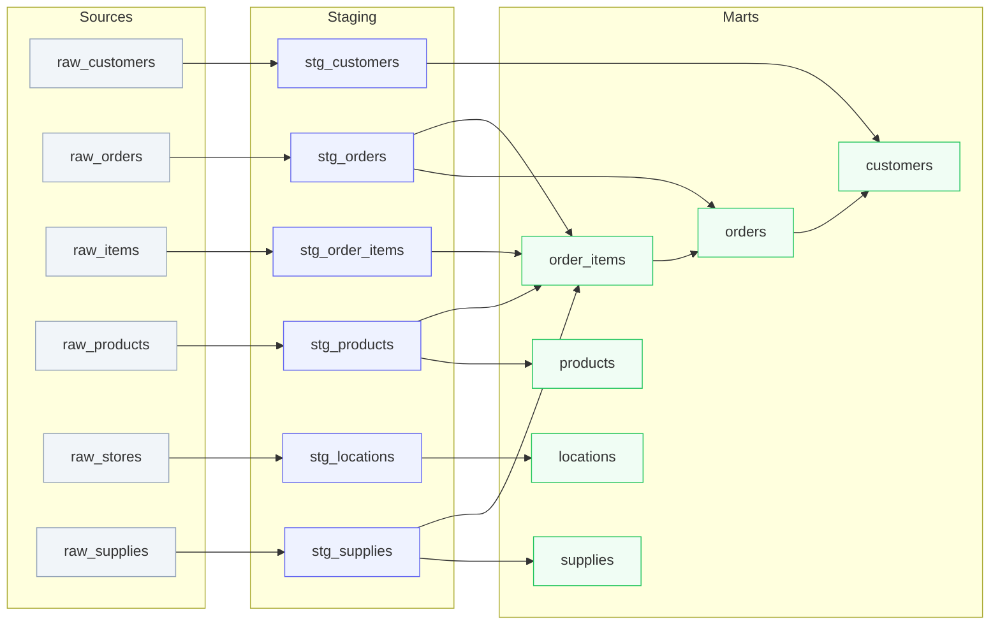

# Model Lineage

Data flow from raw sources through staging to mart models.



**Legend:**
- Gray = Raw sources (seeds)
- Purple = Staging views
- Green = Mart tables

> This is the v1 static Mermaid DAG. Interactive features (layer filter tabs, click-to-detail panels, parameterized drill-down pages) are planned for a future iteration.

```sql row_counts
SELECT 'customers' as model, count(*) as rows FROM jaffle_shop.customers
UNION ALL SELECT 'orders', count(*) FROM jaffle_shop.orders
UNION ALL SELECT 'order_items', count(*) FROM jaffle_shop.order_items
UNION ALL SELECT 'products', count(*) FROM jaffle_shop.products
UNION ALL SELECT 'locations', count(*) FROM jaffle_shop.locations
UNION ALL SELECT 'supplies', count(*) FROM jaffle_shop.supplies
ORDER BY rows DESC
```

## Current Row Counts

<DataTable data={row_counts}>
  <Column id=model title="Model" />
  <Column id=rows title="Rows" fmt="#,##0" />
</DataTable>
